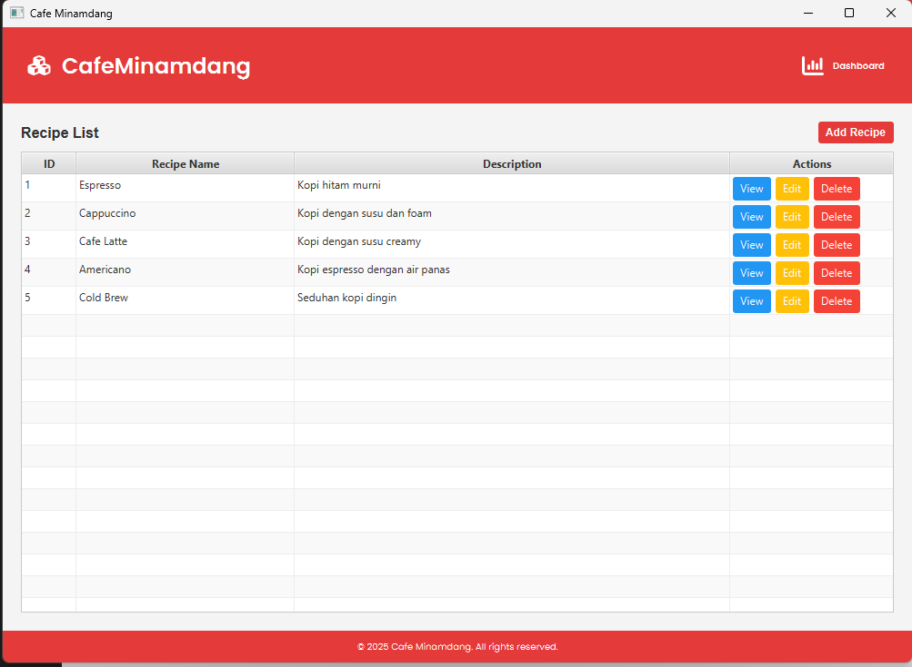
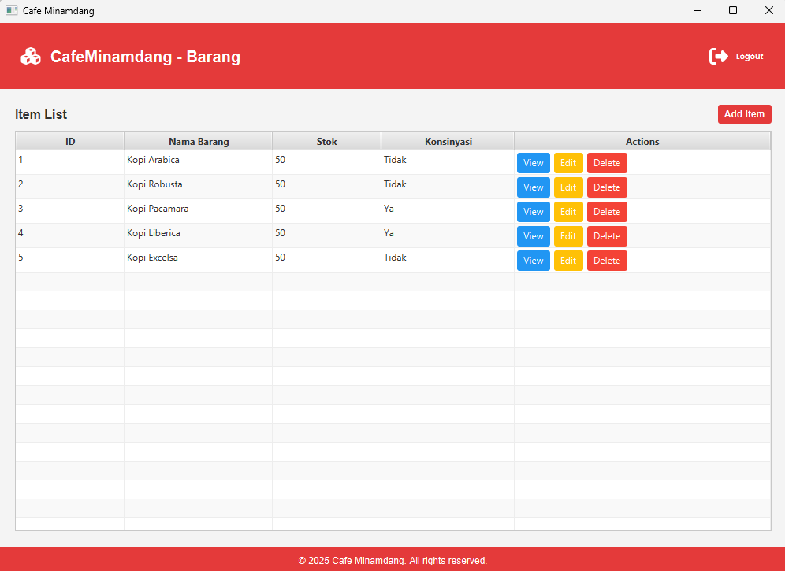
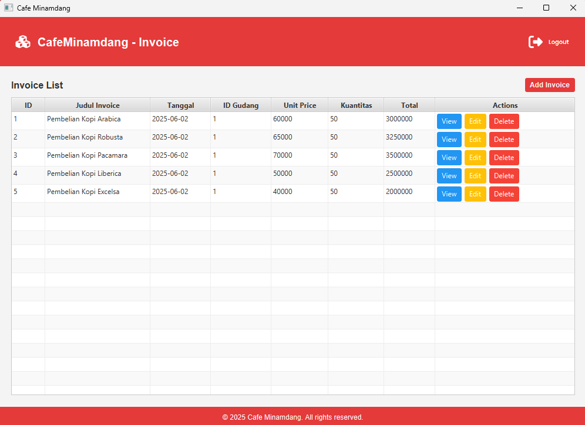

# Cafe Minamdang

Aplikasi ini merupakan tugas besar mata kuliah IF2050 Dasar Rekayasa Perangkat Lunak. Sistem yang dikembangkan adalah aplikasi manajemen Cafe Minamdang, untuk membantu proses pemesanan, pembayaran, pengelolaan stok, dan administrasi cafe.


---

## Daftar Isi

- [Cara Menjalankan Aplikasi](#cara-menjalankan-aplikasi)
- [Struktur Folder Utama](#struktur-folder-utama)
- [Daftar Modul yang Diimplementasi](#daftar-modul-yang-diimplementasi)
- [Tabel Basis Data](#tabel-basis-data)
- [Contributors](#contributors)

---

## Cara Menjalankan Aplikasi

**Prasyarat:**  
- Java (JDK 8 atau lebih baru)
- Maven

**Langkah-langkah:**
1. Clone repository:
   ```
   git clone https://github.com/gitaa001/IF2050-2025-K3K-Cafe-Minamdang.git
   ```
2. Masuk ke direktori proyek:
   ```
   cd IF2050-2025-K3K-Cafe-Minamdang/CafeMinamdang
   ```
3. Compile dan jalankan aplikasi menggunakan Maven:
   ```
   mvn compile exec:java
   ```

## Struktur Folder Utama
Struktur folder utama pada aplikasi ini mengikuti konvensi Maven standar, yaitu memisahkan kode utama, kode pengujian, dan hasil build. Berikut struktur utamanya:
- `CafeMinamdang/`
  - `pom.xml` — Konfigurasi Maven
  - `src/main/` — Source code utama aplikasi
  - `src/test/` — Unit test
  - `target/` — Hasil build Maven

## Daftar Modul yang Diimplementasi

### Fitur Resep

> Fitur ini memungkinkan pengguna untuk mengelola resep-resep yang digunakan oleh Cafe Minamdang. Melalui fitur ini, pengguna dapat menambah resep baru, melihat daftar resep, melakukan pembaruan pada resep yang sudah ada, dan menghapus resep yang tidak diperlukan. Berikut tampilan dan modul-modul yang terdapat pada fitur resep:



Gambar di atas merupakan tampilan daftar resep pada aplikasi. Pada halaman ini, pengguna dapat melihat seluruh resep yang tersedia, melakukan pencarian, serta mengakses fitur tambah, edit, dan hapus resep sesuai kebutuhan.

| No | Modul         | Deskripsi Singkat                                      |
|----|--------------|--------------------------------------------------------|
| 1  | Add Resep    | Menambah resep baru ke dalam database aplikasi         |
| 2  | View Resep   | Melihat daftar resep beserta detailnya                 |
| 3  | Update Resep | Mengubah atau memperbarui data resep yang sudah ada    |
| 4  | Delete Resep | Menghapus resep dari database                          |

### Fitur Barang

> Fitur barang digunakan untuk mengatur data barang yang ada di Cafe Minamdang, baik penambahan, melihat daftar barang, memperbarui data, hingga penghapusan barang. Pengelolaan barang ini sangat penting untuk manajemen stok dan inventaris cafe. Berikut adalah tampilan dan daftar modul pada fitur barang:



Gambar di atas menunjukkan tampilan daftar barang pada aplikasi. Melalui halaman ini, pengguna dapat melihat seluruh barang yang tersedia beserta detailnya, serta melakukan aksi seperti menambah, mengedit, atau menghapus barang.

| No | Modul         | Deskripsi Singkat                                      |
|----|--------------|--------------------------------------------------------|
| 1  | Add Barang   | Menambah data barang baru ke sistem                    |
| 2  | View Barang  | Menampilkan seluruh daftar barang beserta detailnya    |
| 3  | Update Barang| Memperbarui informasi barang yang sudah ada            |
| 4  | Delete Barang| Menghapus data barang dari sistem                      |

### Fitur Invoice

> Fitur invoice menyediakan sarana untuk mengelola tagihan (invoice) pada Cafe Minamdang. Fitur ini mendukung pembuatan invoice baru, melihat detail invoice, melakukan pembaruan informasi, serta penghapusan invoice jika diperlukan. Berikut tampilan dan modul-modul pada fitur invoice:



Gambar di atas merupakan tampilan daftar invoice pada aplikasi. Melalui halaman ini, pengguna dapat melihat seluruh invoice yang telah dibuat, mengakses detail setiap invoice, serta melakukan pembaruan atau penghapusan invoice sesuai kebutuhan.

| No | Modul          | Deskripsi Singkat                                      |
|----|---------------|--------------------------------------------------------|
| 1  | Add Invoice   | Membuat dan menambah invoice baru ke sistem            |
| 2  | View Invoice  | Melihat daftar invoice serta informasinya              |
| 3  | Update Invoice| Mengedit atau memperbarui data invoice yang sudah ada  |
| 4  | Delete Invoice| Menghapus invoice dari sistem                          |

## Tabel Basis Data

Berikut adalah tabel-tabel utama yang digunakan pada basis data aplikasi, lengkap dengan atributnya masing-masing:

| Nama Tabel | Atribut                                 |
|------------|-----------------------------------------|
| Barang      | IDBarang, NamaBarang, Deskripsi, Kuantitas, IsiKonsinyasi, IDGudang            |
| Gudang     | IDGudang, NamaGudang, Lokasi, DeskripsiGudang   |
| Invoice        | IDInvoice, JudulInvoice, Tanggal, IDGudang, UnitPrice, Kuantitas            |
| Penjualan     | IDPenjualan, TotalHarga, Tanggal, IDGudang   |
| Resep     | IDResep, NamaResep, Deskripsi, Preskripsi   |

## Contributors

Berikut adalah daftar kontributor beserta pembagian tugasnya masing-masing:

| **No** | **Nama** | **NIM**  | **Pembagian Tugas** |
| ------ | ---------------------- | ------------- | ----------- |
| 1      | Bagas Noor Fadhilah           | 18223115      | DBMS, database integration, fitur resep, dashboard & penjualan |
| 2      | Khairunnisa Azizah  | 18223117      | Fitur Invoice, documentations |
| 3      | Laras Hati Mahendra      | 18223118      | JUnit testing, documentations |
| 4      | Anggita Najmi Layali| 18223122      | Fitur barang, JUnit testing, documentations |
| 5      | M Rabbani K A      | 18223130      | Fitur switch role, menu |

**Asisten:** Angelica Kierra Ninta Gurning

---
